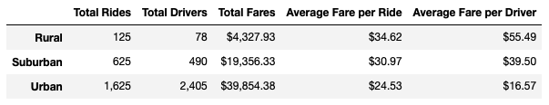
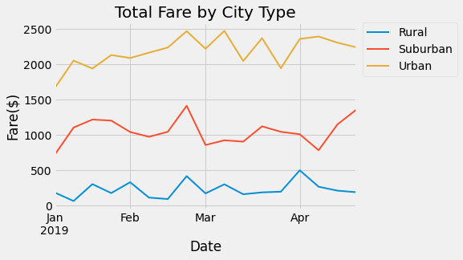

# PyBer-Analysis

## Overview of Analysis

Pyber is a ride sharing company that uses a python-based app. Pyber is looking to improve access and affordability in different city types. The different city types being looked at are urban, suburban, and rural areas. I summary dataframe and visualizations were made to compare these city types.

### Purpose

The purpose of this project is to analyze ride sharing data in order to determine differences by city types. 

## Results
### Summary Dataframe

The summary dataframe that was made from the provided data revels some key differences between the three city types. The most drivers and rides taken are in urban areas and the least in rural areas. Suburban cities fall between these two. The average fare per ride in rural areas is a little over ten dollars more than in urban areas. the average fare per rural driver is over three times as much than that of an urban driver. 
Urban cities are also the only city type with more drivers than total rides. Therefore, the average fare per driver is much lower than the average fare per ride. the suburban fares per ride compared to fares per driver are fairly similar with fare per driver coming out slightly higher than fare per average ride. In rural areas the Average fare per driver is more that $20 higher than the average fare per ride. 

### Multiple-line chart

Based on the graph it is clear that total fares are highest in urban cities and lowest in rural cities. The line chart also shows that while there is some fluctuation week to week in total fares, the fare totals do not change that much longer term. The urban, suburban, and rural lines all stay relatively horizontal from January through April.

## Summary 

Based on the results of this analysis there are some disparities among the three city types. To address this, I recommend the following:
- hire more drivers in rural areas. 
- reduce the fare rate in urban areas. 
- hire more drivers in suburban areas. 